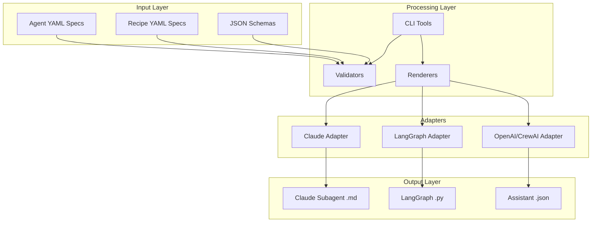

# Architecture Overview

This document provides a comprehensive overview of the Claude Agents Repository architecture, design decisions, and implementation patterns.

## System Architecture



## Core Components

### 1. Specification Layer

**Agent Specification v1**
- Single source of truth for agent definitions
- JSON Schema validated YAML format
- Comprehensive metadata including model config, tools, constraints
- Semantic versioning for specifications

**Recipe Specification v1**
- Multi-agent workflow definitions
- DAG-based execution model with stages
- Support for parallel and sequential execution
- Conditional logic and parameter passing

### 2. Validation System

**Schema Validation**
- JSON Schema Draft 2020-12 compliance
- Structural validation for required fields and formats
- Type checking for all specification fields

**Semantic Validation**
- Business logic validation beyond schema
- Cross-reference checking (e.g., agent references in recipes)
- Custom validation rules per specification type

### 3. Adapter Architecture

The adapter system follows the **Adapter Pattern** to transform specifications into runtime-specific artifacts:

```python
class BaseAdapter:
    def __init__(self, templates_dir: Path)
    def render_agent(self, spec: Dict[str, Any]) -> str
    def generate_agent_file(self, spec_path: Path, output_dir: Path) -> Path
```

**Claude Code Adapter**
- Generates Markdown with YAML front-matter
- Compatible with `~/.claude/agents` installation
- Preserves Claude-specific model tiers (haiku/sonnet/opus)

**LangGraph Adapter**  
- Generates Python classes using LangGraph prebuilt agents
- Includes model initialization and tool routing
- Creates FastAPI server for multi-agent deployment

**Assistant Adapter**
- Generates OpenAI Assistant API configurations
- Maps tools to OpenAI function calling format
- Basic CrewAI compatibility layer

### 4. CLI System

Built with **Typer** for modern CLI experience:

```bash
agents validate [PATH] [--verbose] [--schema=PATH]
agents render TARGET [--agent-id=ID] [--output-dir=PATH] [--install]
agents list-agents [--domain=DOMAIN] [--tag=TAG]
agents init-agent AGENT_ID [--domain=DOMAIN] [--name=NAME]
```

Rich formatting and progress indicators for developer experience.

## Design Decisions

### 1. YAML as Source Format

**Decision**: Use YAML instead of JSON, TOML, or Python for specifications

**Rationale**:
- Human-readable and editable
- Supports multi-line strings (essential for prompts)
- Wide tooling support (linting, validation)
- Git-friendly for diffs and reviews

**Trade-offs**: 
- Slightly more complex parsing than JSON
- YAML gotchas (tabs, indentation sensitivity)

### 2. Jinja2 Template Engine

**Decision**: Use Jinja2 for artifact generation

**Rationale**:
- Powerful templating with control structures
- Familiar syntax for Python developers  
- Excellent error reporting and debugging
- Extensible with custom filters

**Trade-offs**:
- Additional dependency
- Template complexity can grow

### 3. JSON Schema for Validation

**Decision**: Use JSON Schema Draft 2020-12 for specification validation

**Rationale**:
- Industry standard for API and data validation
- Comprehensive validation features (patterns, enums, conditionals)
- Excellent tooling and IDE support
- Self-documenting specifications

**Trade-offs**:
- Learning curve for complex schemas
- Limited custom validation (requires semantic layer)

### 4. Monorepo Structure

**Decision**: Single repository with multiple domains and adapters

**Rationale**:
- Centralized governance and quality control
- Shared tooling and CI/CD pipelines
- Cross-domain agent discovery
- Consistent versioning and releases

**Trade-offs**:
- Larger repository size
- Potential for merge conflicts
- Requires careful dependency management

## Data Flow

### Agent Creation Flow

1. **Specification** → Developer creates/edits YAML spec
2. **Validation** → CLI validates against JSON Schema + semantics  
3. **Rendering** → Adapter transforms spec using Jinja2 templates
4. **Output** → Runtime-specific artifacts generated
5. **Installation** → Optional deployment to runtime environment

### Recipe Execution Flow (Conceptual)

1. **Recipe Loading** → YAML parsed and validated
2. **Graph Construction** → DAG built from stages and dependencies
3. **Agent Resolution** → Agent specs loaded and validated
4. **Execution Planning** → Parallel/sequential execution plan
5. **Stage Execution** → Individual agents invoked with context
6. **Result Aggregation** → Outputs collected and passed between stages

## Extension Points

### 1. New Adapters

To add support for new runtimes:

```python
class MyRuntimeAdapter(BaseAdapter):
    def render_agent(self, spec: Dict[str, Any]) -> str:
        template = self.env.get_template('my_runtime.jinja')
        return template.render(spec=spec)
```

Add template in `templates/my_runtime.jinja` and CLI command in `scripts/cli.py`.

### 2. Custom Validation

Extend semantic validation:

```python
class CustomAgentValidator(AgentValidator):
    def _validate_custom_semantics(self, data: Dict[str, Any]) -> List[str]:
        errors = super()._validate_custom_semantics(data)
        # Add custom validation logic
        return errors
```

### 3. New Tool Types

Add new tool integration types in schema:

```json
{
  "properties": {
    "tools": {
      "items": {
        "properties": {
          "type": {
            "enum": ["mcp", "http", "builtin", "custom", "my_new_type"]
          }
        }
      }
    }
  }
}
```

Update adapters to handle new tool types.

## Security Architecture

### 1. Secrets Management

**Principle**: Never commit secrets to repository

**Implementation**:
- Pre-commit hooks detect potential secrets
- CI/CD scans for hardcoded credentials
- Runtime configuration via environment variables
- Secret injection at deployment time

### 2. PII Handling

**Configurable per agent**:
- `allow`: No PII restrictions
- `mask`: Automatically mask detected PII
- `forbid_raw_pii`: Reject requests with raw PII

**Implementation**: Runtime-specific, adapter generates appropriate configuration

### 3. Cost Controls

**Multi-level budgeting**:
- Per-agent daily budgets in USD
- Token limits per request
- Timeout controls for long-running operations

## Performance Considerations

### 1. Template Compilation

Jinja2 templates are compiled once per CLI invocation, cached in memory.

### 2. Schema Validation

JSON Schema validation is fast for well-structured documents. Consider caching for large batch operations.

### 3. File I/O

All file operations use pathlib for cross-platform compatibility. Consider async I/O for large batch processing.

### 4. Memory Usage

Current implementation loads all specifications into memory. For very large repositories (1000+ agents), consider streaming or lazy loading.

## Testing Strategy

### 1. Unit Tests
- Schema validation correctness
- Template rendering output
- CLI command functionality  
- Adapter generation accuracy

### 2. Integration Tests
- End-to-end specification → artifact generation
- Multi-agent recipe validation
- Cross-adapter compatibility

### 3. Property-Based Testing
- Generate random valid specifications
- Fuzz testing for edge cases
- Schema evolution compatibility

### 4. Performance Tests
- Large repository handling
- Concurrent agent rendering
- Memory usage profiling

## Monitoring & Observability

### 1. CLI Metrics
- Command usage patterns
- Validation error frequencies
- Generation success rates

### 2. Agent Metrics (Runtime-specific)
- Invocation frequency
- Response quality scores
- Cost tracking
- Performance metrics

### 3. Quality Metrics
- Test coverage
- Documentation coverage
- Schema compliance rates
- Security scan results

## Future Architecture Considerations

### 1. Distributed Architecture
- Agent registry service
- Centralized validation API
- Distributed rendering workers

### 2. Runtime Integration
- Direct deployment APIs
- Health checking and monitoring
- Automatic rollback capabilities

### 3. Advanced Workflows
- Complex conditional logic
- Loop and retry mechanisms
- Human-in-the-loop approvals
- Cross-runtime orchestration